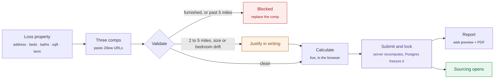

<div align="center">

<picture>
  <source media="(prefers-color-scheme: dark)" srcset="docs/assets/hero-dark.svg">
  
</picture>

<h1>FRV</h1>

<p><strong>The monthly housing ceiling on an insurance claim — calculated once, defended forever.</strong></p>

<p>
  
  
  
  
</p>

</div>

---

When a home becomes uninhabitable, a policy's Additional Living Expenses coverage pays for somewhere else to live. The **Fair Rental Value** is the monthly ceiling on that spend. Carriers don't calculate it themselves — setting a number you have a financial interest in keeping low is a lawsuit — so they hand it to a neutral third party.

That third party is Nova Havens. This is the tool that produces the number.

An account manager enters the loss property, pastes three Zillow listings, and receives a single-page report an adjuster can approve without picking up the phone. Every rule in the methodology is enforced by the software, the arithmetic is reproducible to the cent from stored data alone, and once the figure locks, the database itself refuses to let it move.

## The number

```
FRV  =  (base comp rent × short-term multiplier)  +  furniture  +  management fee
```

Applied to each of three unfurnished comparables, sorted high to low, then **averaged**.

<table>
<tr><td valign="top">

| Approved term | Multiplier |
|:--|--:|
| 1 – 2 months | × 1.40 |
| 3 – 5 months | × 1.30 |
| 6 – 9 months | × 1.25 |
| 10 – 11 months | × 1.10 |
| 12 months | × 1.00 |

</td><td valign="top">

| Bedrooms | Furniture / month |
|:--|--:|
| 1 | $1,059 |
| 2 | $1,267 |
| 3 | $1,456 |
| 4 | $1,600 |
| 5 | $1,746 |

</td><td valign="top">

| Reference claim | FRV |
|:--|--:|
| Coppell, TX · 3 comps · 3 mo | **$6,448.50** |
| Camarillo, CA · 2 mo | **$10,145** |

Both are acceptance fixtures. The suite fails if either moves by a cent.

</td></tr>
</table>

Management fee defaults to $240, is editable per claim, and accepts zero. The blank template in Drive lists the 6–9 month tier at 24%; that template is wrong, and a test asserts 25%.

## How a claim moves



The figure updates as the account manager types. Submit is the only state change.

## The five rules

These lived in a reference guide as advice for people. Here they are system behaviour, because a rule that is only documented is a rule that gets skipped at 4pm on a Friday.

| | Rule | Enforced by | When it fails |
|:-:|:--|:--|:--|
| **1** | Unfurnished comps only | Furnished flag and listing-text keyword scan in the engine, plus a `check` constraint so a furnished comp cannot even be stored | Rejected. No override exists, at any permission level. |
| **2** | FRV before sourcing | `sourcing_unlocked` is set only by the lock transition | Sourcing stays closed |
| **3** | Sort high to low | `sort_position` persisted with the record, never recomputed at render | Re-sorted; entry order kept in the audit trail |
| **4** | Geography over everything | Haversine bands from coordinates captured at intake: <1 mi, 1–2 mi, 2–5 mi needs justification, >5 mi halts | Past five miles the calculation stops rather than widening |
| **5** | Locked once set | Postgres triggers on `claims`, `comps` and `calculations`; `open_revision()` is the only way through | A new immutable version plus a reason-coded revision record |

Bedroom count is enforced. **Bathroom count deliberately is not** — a 4-bed/2.5-bath comp was correctly used for a 3-bed/3-bath loss because square footage and location mattered more. See [the decision log](docs/DECISIONS.md#bathrooms-are-not-matched).

## Architecture

```
src/
├── lib/
│   ├── frv/            Pure calculation core. No I/O, no framework, no network.
│   │   ├── constants.ts    The locked methodology — changing a value here needs Lou
│   │   ├── money.ts        Integer-cent arithmetic and formatting
│   │   ├── geo.ts          Haversine distance and radius bands
│   │   ├── multiplier.ts   Term tiers and furniture rates
│   │   ├── validate.ts     The rules as executable checks
│   │   ├── calculate.ts    Selection (high-to-low) and output (three-comp average)
│   │   └── listing-url.ts  Zillow URL → street address
│   ├── listings/       Listing metadata providers, behind one interface
│   ├── report/         Report view-model and verbatim declarations
│   ├── db/             Supabase access — the only layer that knows about storage
│   └── env.ts          Environment, validated once
├── components/         UI bound to design tokens. No hardcoded colour anywhere.
└── app/
    ├── claims/new/     Intake: one page, live figure, server actions
    ├── report/         On-screen report
    └── api/            PDF rendering, health check

supabase/   Schema, lock triggers, open_revision(), seed
tests/      Acceptance fixtures against the PRD reference reports
docs/       Decision log, assets
```

Four ideas carry the whole design.

**The core is a pure island.** Nothing from React, Next or Supabase reaches into `lib/frv`. That is what makes the fixtures meaningful, and it is why the browser can run the exact code the server runs — the live preview isn't an approximation of the answer, it *is* the answer. The server recomputes on submit regardless; a figure that reaches an adjuster must not have been produced on a machine we don't control.

**Money is integer cents.** Dollars exist only at parse and format. A multiply-then-average chain in floating point accumulates error, and this number is the ceiling on someone's housing for months.

**The lock is a database trigger, not a hidden button.** Hiding a control is a suggestion; a rejected write is a guarantee. It holds against the app, a script, and the Supabase dashboard alike.

**Reports render from stored figures.** `loadLockedClaim()` reads the `calculations` row and never consults the engine, so a future change to the arithmetic cannot restate a report an adjuster has already accepted. One view-model feeds both the web preview and the PDF; layout may differ between them, content cannot.

## Listing data

Paste a Zillow listing URL and the comp fills itself: rent, bedrooms, bathrooms, square footage, coordinates.

This runs through **Firecrawl's catalogued Zillow capability**, approved by Will and Lou in October 2026. Its scope is deliberately narrow:

- **`properties/rental` only** — metadata for the one listing the account manager already chose.
- **Never `rental_search`.** That is comp discovery, which the PRD excludes. Comp selection stays human because geography is where FRVs go wrong, and no tool reliably tells one side of a boundary road from the other.
- **Every field stays editable**, and the audit trail records which ones the operator changed. The lookup saves typing; it is never the source of truth.
- **Expired listings are refused.** A comp that is no longer for rent is not evidence.
- **The data remains Zillow's.** Records carry an attribution string, and any report built from them prints it.

Zillow itself has offered no public API since September 2021, and its partner programme requires MLS membership. Lookup is one environment variable away from off — `LISTING_PROVIDER=manual` — and the form works identically either way. A licensed provider can replace Firecrawl by implementing `ListingProvider` without touching the form, the engine or the report.

## The report

Section structure follows the Alacrity format carriers already receive — Loss Address Details, FRV Address Details, 12-month FRV Details, guideline tables, neutrality declaration — so an adjuster finds every number where they always have. Underneath, it's Nova Havens' methodology: three comps averaged where Alacrity carries one, with both of their totals preserved and a test asserting they reconcile.

The guideline tables on the page are generated from the same constants the engine reads. The workings an adjuster checks can never disagree with the arithmetic that produced the figure above them.

## Quick start

```bash
git clone https://github.com/<org>/FRV.git && cd FRV
cp .env.example .env.local
npm install
npm run dev
```

Without Supabase configured, the app renders the Coppell reference claim and says so on screen. An unlabelled sample that looks real is how someone emails a fake FRV to an adjuster.

To run against a real database:

```bash
psql "$DATABASE_URL" -f supabase/migrations/0001_init.sql
psql "$DATABASE_URL" -f supabase/seed.sql      # optional reference claim
```

| Command | Does |
|:--|:--|
| `npm run dev` | Local server at `localhost:3000` |
| `npm test` | Acceptance fixtures and unit tests |
| `npm run typecheck` | Strict TypeScript, `noUncheckedIndexedAccess` on |
| `npm run verify` | Typecheck, test and production build — the pre-push gate |

## Deploying

Vercel, Node runtime. Set the variables from `.env.example`, then point the deploy gate at **`GET /api/health`** — it checks configuration and database reachability, and returns `503` until both are sound. Environment is validated in `src/lib/env.ts`, so a missing key fails at boot, not when someone hits submit.

## Status

| | |
|:--|:--|
| ✅ | Calculation core, validation, fixtures |
| ✅ | Schema with trigger-enforced locking and `open_revision()` |
| ✅ | One-page intake with live figure and Firecrawl listing lookup |
| ✅ | Report — web preview and PDF from one view-model, with attribution |
| ✅ | Stored-figure reads, seed data, health check, env validation |
| ◻️ | Revision flow UI |
| ◻️ | Claim list |
| ◻️ | Authentication — deferred; *Prepared by* writes to every audit row until then |

## Not built, on purpose

No comp discovery. No maps. No amenity fields. No market-value input. No insured-facing views — the insured never sees the FRV.

---

<div align="center">
<sub>Internal to Nova Havens. Methodology in <code>src/lib/frv/constants.ts</code> reflects decisions by Lou and requires her sign-off to change.</sub>
</div>
